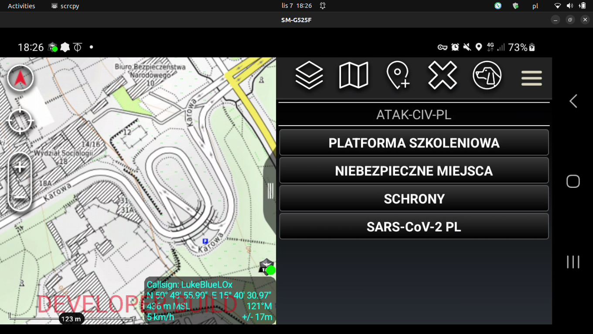

_________________________________________________________________

### ATAK-CIV-PL

https://www.linkedin.com/in/lukebluelox/details/featured

_________________________________________________________________

_________________________________________________________________
PURPOSE AND CAPABILITIES:

- Polish Civil Defense

_________________________________________________________________
STATUS: 
- In Progress  

Expected release: 
- ???  

Released:
- ATAK-Plugin-ATAK-CIV-PL-1.0--4.6.0-civ-debug.apk

https://github.com/LukeBlueLOx/ATAK-CIV-PL/releases

To Who: 
- Polish Civil Defense

When: 
- ???

_________________________________________________________________
POINT OF CONTACTS:

- LukeBlueLOx

luke.blue.lox@gmail.com

_________________________________________________________________
PORTS REQUIRED:

(This is important for ATO, networking, and other security concerns)

_________________________________________________________________
EQUIPMENT REQUIRED:

_________________________________________________________________
EQUIPMENT SUPPORTED:

_________________________________________________________________
COMPILATION:

_________________________________________________________________
DEVELOPER NOTES:
